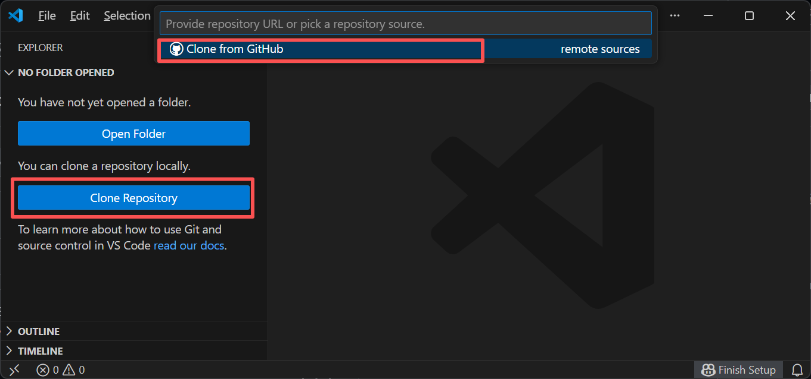
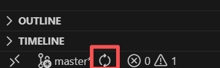
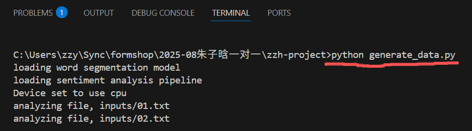

## 同步代码

下载`Git`：从https://git-scm.com/下载windows版`Git`的安装包，并安装。

安装完成后在`vs code`菜单选择`文件->新建窗口`，打开一个新的空白窗口，在左侧窗口可以选择“克隆Git仓库”，然后点击“从Github克隆”，在输入框输入这个代码仓库的github链接：`twoxey/zzh-project`，之后选择一个保存的文件夹位置，就能把代码同步到自己电脑。



之后每当有新的内容时，点击`vs code`左下角的同步按钮就能同步新的变更。



## 数据生成

[`generate_data.py`](generate_data.py) 文件是根据之前情绪分析的测试代码用来生成实际用于绘图的数据

## 使用方法

文件夹结构要与代码仓库中的相同：`generate_data.py`, `inputs`文件夹, `sentiment_data.js`, 还有`p5.html`文件需要在同一个文件夹下。将不同的测试语段以纯文本格式保存在inputs文件夹中，之后使用`python`运行`generate_data.py`文件，这样会收集所有`inputs`文件夹中的文件并分析，最后生成`sentiment_data.js`文件。

## 运行`python`文件

在`vs code`当中打开项目文件夹，并且在上方菜单选择`终端->新建终端`。在打开的命令行窗口当中输入：

```cmd
python generate_data.py
```



运行完成后会生成`sentiment_data.js`文件。

